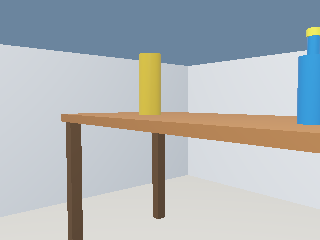
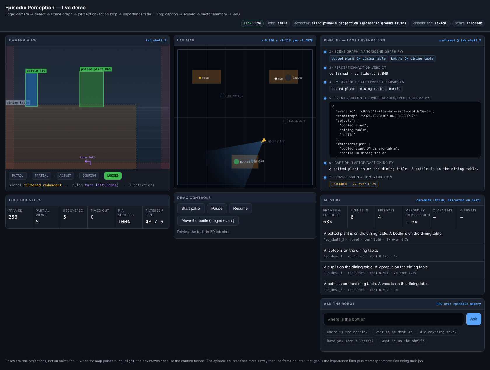

# Demo run results

Measured numbers from the two live demos. These are **simulation** results, and
they do not replace Phase 9, which asks for 15-20 recordings from the physical
robot in the real lab. What they do give is a working end-to-end pipeline and a
set of measurements the real runs can be compared against.

Everything below was produced by running the commands shown — nothing here is
estimated. Re-running them will give slightly different numbers (seeded motor
noise, different detector timing), but the same shape.

## How to reproduce

```bash
# browser demo
python -m demo.run_demo --time-scale 0.05 --laps 3

# Webots, against the same fog node
python -m demo.run_demo --no-sim &
./scripts/run_webots_demo.sh --headless
cat webots/controllers/episodic_robot/run_summary.json
```

## What was measured, and how

| Metric | Method |
|---|---|
| Perception-action success rate | entries into `ADJUST` that reached a confirmed full view, vs. those that timed out; counted by the controller, which tracks whether a given target ever needed correction |
| Compression ratio | frames processed vs. episodes stored (the Phase 9 definition), plus the event-to-episode merge factor on its own |
| Retrieval | five fixed questions against the stored memory, checked by hand against the ground truth of what the robot had actually seen |
| Query latency | `time.perf_counter()` around `laptop.rag_query.answer_question`, reported by `FogPipeline.snapshot()` |

## Results

Recorded 2026-10-08, lexical embedding fallback, software rendering, no GPU.
Raw output in [`demo_results_data.md`](demo_results_data.md).

| | Webots (2 laps) | Browser 2D sim (3 laps) |
|---|---|---|
| Frames processed | 840 | 810 |
| Partial views entered | 10 | 12 |
| Recovered to a full view | 8 | 12 |
| Timed out | 2 | 0 |
| **Perception-action success rate** | **80 %** | **100 %** |
| Redundant observations filtered (Phase 4) | 235 | 147 |
| Events sent to the fog node | 11 | 13 |
| Episodes stored | 6 | 6 |
| Event-to-episode merge (Phase 7) | 1.83× | 2.17× |
| **Frames per stored episode** | **140×** | **135×** |
| Query latency, mean / p95 | 3.9 / 6.4 ms | 3.5 / 8.0 ms |
| Retrieval check (5 fixed questions) | 5/5 | 5/5 |

The two Webots timeouts are the 10 cm cup at `lab_desk_1`, which can never
satisfy the fixed `min_height` from a sane viewing distance. That is the
designed `partial_timeout` path, left in on purpose so the demo shows the loop
failing gracefully as well as succeeding — see `demo_results_data.md` for the
full reading of these numbers.

## Detector note

The headline runs use ground-truth detection (tight bounding boxes projected
from the simulator's own geometry in Webots, pinhole projection in the 2D sim).
That is a deliberate choice for a live demo: it is deterministic, and it
isolates the thing the project is actually about — the perception-action loop
and the memory — from detector noise.

The real COCO-pretrained SSD-MobileNet-V2 is wired in and runs
(`--detector ssd`); `nano/detector.py` loads it through `cv2.dnn` with the
correct TensorFlow-graph preprocessing. It works: on photographs it scores
0.99 "person" and 0.98 "sports ball".

On the Webots lab it does not. This is what the robot's camera sees at the
`lab_desk_3` station — the desk, the vase centred, the bottle clipped on the
right edge:



and this is everything SSD-MobileNet-V2 reports on that exact frame, at every
threshold down to 0.15:

```
bench  0.851  bbox (0.147, 0.163) - (0.998, 0.985)
```

One detection. It finds the desk and calls it a bench — a fair confusion for an
untextured brown slab — and misses the bottle and the vase completely. That is
a property of the **renderer**, not of the detector or of the pipeline: a
COCO-trained network has never seen a bottle that looks like a smooth blue
cylinder with no label, no highlights and no texture. Photoreal assets or a
fine-tune on self-collected lab frames (which is what Phase 9 is for) would be
the fix.

So: use `--detector groundtruth` for the demo, and demonstrate the detector on
real imagery instead:

```bash
./scripts/fetch_ssd_model.sh
python -m nano.main_loop --mode usb --display
```

## The dashboard



## What these numbers are not

- Not a substitute for Phase 9's real-lab dataset. Simulated frames have no
  motion blur, no rolling shutter, no lighting variation and no detector false
  positives, all of which will lower the real success rate.
- Retrieval quality depends on the embedding backend. Where
  `all-MiniLM-L6-v2` cannot be downloaded, `laptop/embeddings.py` falls back to
  a lexical embedder and matching becomes keyword-based. The runs are labelled
  with whichever backend was live.
